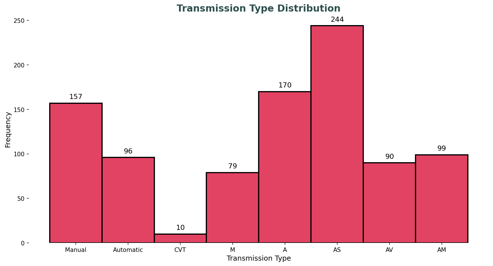
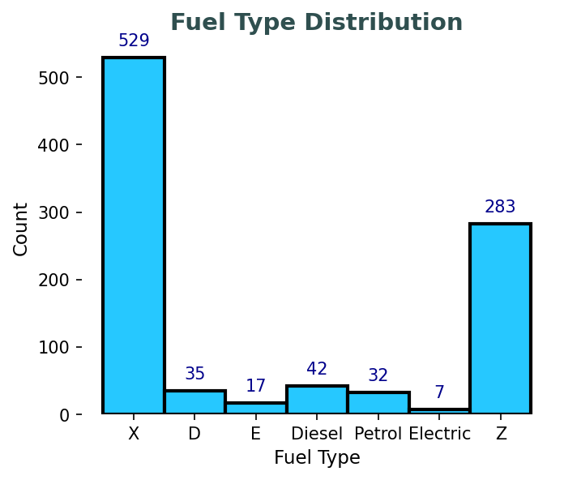
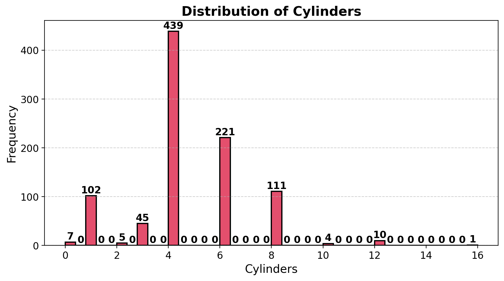
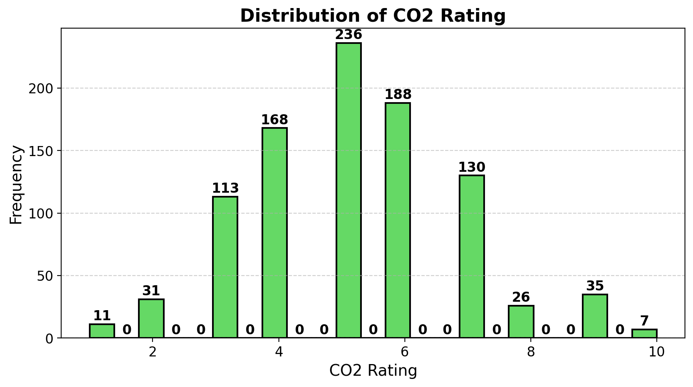
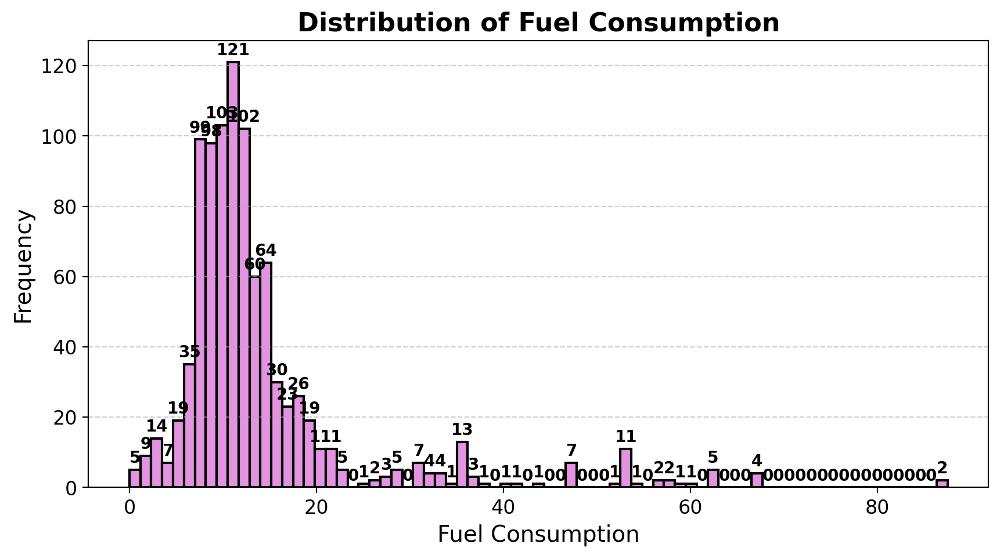
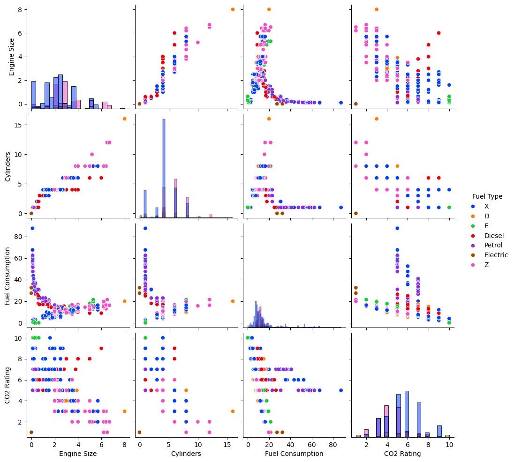
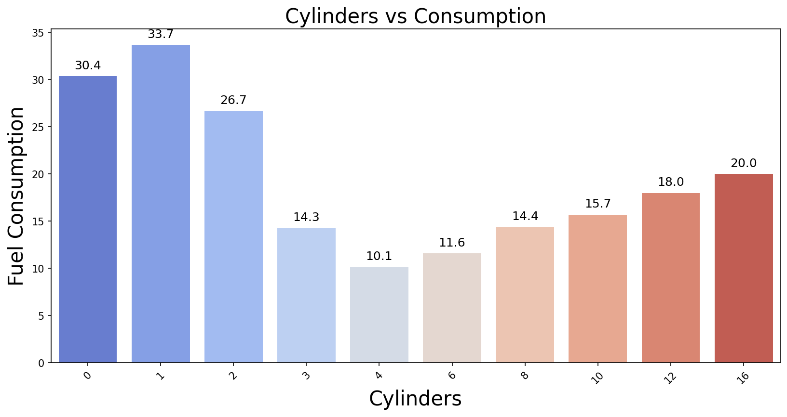
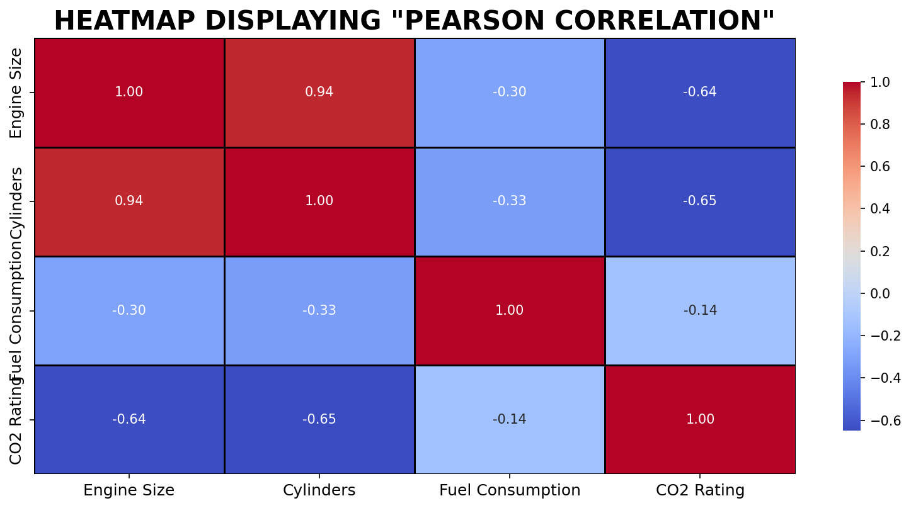

# ⛽ Fuel Per Kilometer Analysis

A data science project that analyzes and visualizes fuel efficiency of vehicles based on real-world data. It helps identify cars that offer the **best mileage per kilometer**, using machine learning techniques like **linear regression** and **data filtering**.

---

## 📊 Overview

This project:
- Loads a dataset of over **1000 car entries**
- Explores relationships between **mileage**, **fuel tank capacity**, and **distance covered**
- Applies **regression models** to predict fuel efficiency
- Provides **visual insights** on the most fuel-efficient vehicles

---

## 🛠️ Tech Stack

| Language | Libraries             | Tools                       |
|----------|-----------------------|-----------------------------|
| Python   | pandas, numpy         | Jupyter Notebook ('.ipynb') |
|          | matplotlib, seaborn   | scikit-learn (for regression) |

---

## 📷 Screenshots <br>
<table> <tr> <td></td> <td></td> </tr> </table>
<table> <tr> <td></td> <td></td> </tr> <tr> <td></td> <td></td> </tr> </table>
  

### 🚀 How to Run the Project

#### 1. Clone the Repository
```bash

git clone https://github.com/RitzwiK/Fuel-Per-Kilometer-Analysis.git
cd Fuel-Per-Kilometer-Analysis
```
2. (Optional) Create and Activate a Virtual Environment
Windows:
```bash
python -m venv venv
venv\Scripts\activate
```
macOS/Linux:
```bash
python3 -m venv venv
source venv/bin/activate
```
3. Install Required Libraries
If you have a requirements.txt:
```bash
pip install -r requirements.txt
```
Or install manually:
```bash
pip install pandas numpy matplotlib seaborn scikit-learn jupyter
```
4. Launch the Jupyter Notebook
```bash
jupyter notebook
```
Then open:
```bash
notebooks/FuelAnalysis.ipynb
```

## 📁 Folder Structure

Fuel-Per-Kilometer-Analysis/
├── data/
│   └── car_fuel_data.csv        # Dataset used
├── notebooks/
│   └── FuelAnalysis.ipynb       # Jupyter notebook with EDA + ML
├── screenshots/
│   └── correlation_plot.png
│   └── regression_result.png
├── README.md

## 📌 Features <br>
🔍 Exploratory Data Analysis (EDA)

📈 Linear regression to predict fuel efficiency

📊 Mileage vs. Fuel Usage scatter plots

📌 Highlights top fuel-efficient vehicles

📂 Clean modular structure for data + code separation

## 🧠 Future Enhancements
•Use real-time API-based fuel data

•Build a web dashboard with Streamlit

•Add multiple ML models for better prediction

•Vehicle clustering using KMeans
